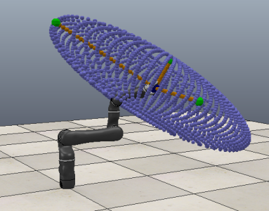
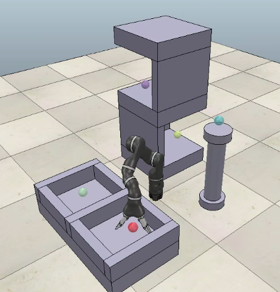
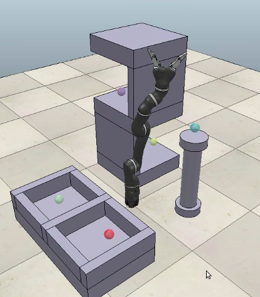
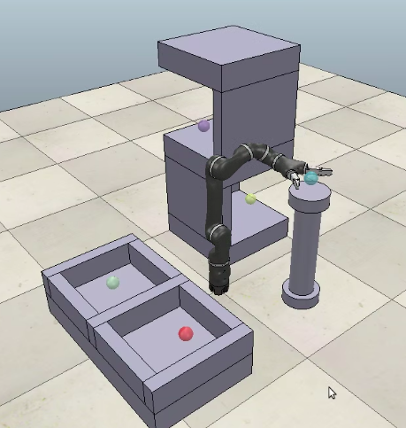
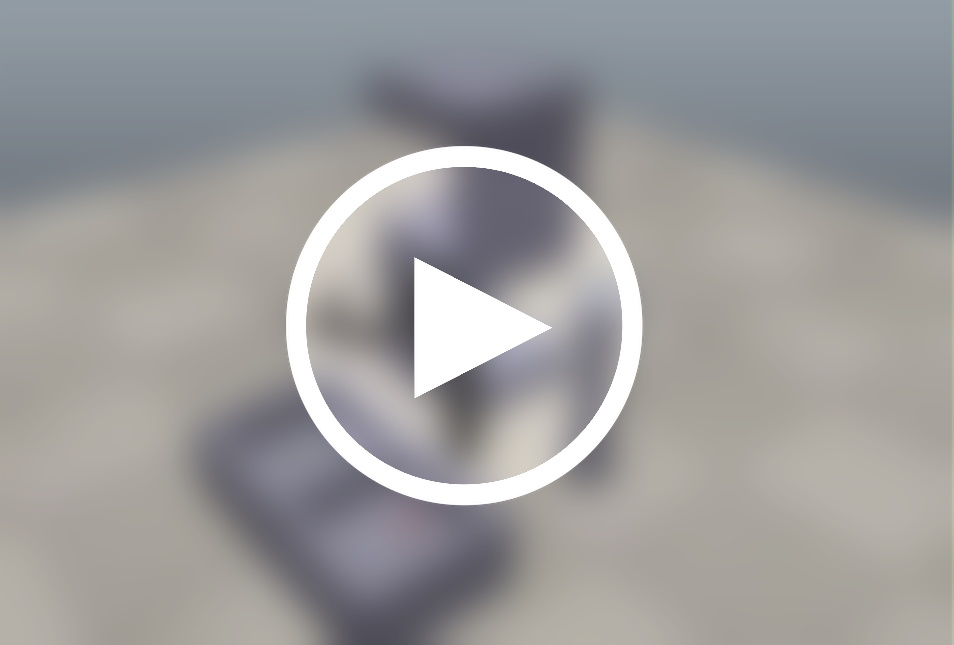

# Robotics
Usage of this code required the robotics simulation program V-REP, or otherwise a real life 7-R with motion and sensor tracking.

**Note**: VREP is now discontinued, replaced by [CoppeliaSim](https://www.coppeliarobotics.com/downloads) which was not tested.

The program has various calculations in place, such as calculating the end effector using Denavit Hartenberg or Product of Exponentials.
Further, `positionIdentification` is able to calculate the Manipulability Ellipsoid based on the current position.
Using the calculated provided, we avoid Gimbal Lock when possible.
Do note, if using on a different type of robot, the calculations would have to be redone.

--------------

## Position Identification

Here is an example of the Manipulability Ellipsoid using the following data:

#### Joint Angles

Angle 1|Angle 2|Angle 3|Angle 4|Angle 5|Angle 6
:---: | :---: | :---: | :---: | :---: | :---: | 
30|-45|-60|60|30|60

#### EE Pose

Matrix|⠀⠀|⠀⠀|⠀⠀
:---: | :---: | :---: | :---: 
-0.811|0.207|-0.546|-0.03
-0.156|-0.978|-0.139|0.171
-0.563|-0.027|0.826|0.866
0|0|0|1

#### Manipulability Ellipsoid

--------------

## Path Finding

Start Position|Middle Position|End Position
:---: | :---: | :---:
|||

#### Video showing complete path finding from two sample positions-

